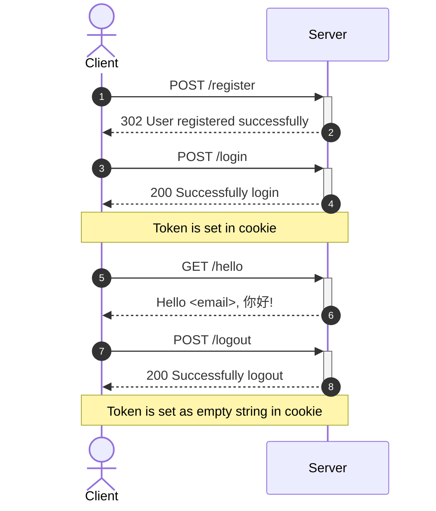

# worker-auth

- [worker-auth](#worker-auth)
  - [Motivation](#motivation)
  - [User Workflow](#user-workflow)
  - [Requirements](#requirements)
  - [Setup](#setup)
  - [Usage](#usage)
  - [Reference](#reference)

## Motivation

This project uses token (JWT) based authentication (contrary to session-based authentication). Generally, there are different 3 common ways one can store authentication tokens:

1. Cookie
2. Session Storage
3. Local Storage

This repository aims to demonstrate the difference between the 3.

## User Workflow

The diagram below shows how we implement user registration, login, and authorization.



## Requirements

-   A [Cloudflare](https://www.cloudflare.com/) account
-   Install [Wrangler CLI](https://developers.cloudflare.com/workers/wrangler/cli-wrangler/) for Cloudflare Workers deployment

## Setup

```sh
❯ npm ci
# ...omitted for brevity...

❯ wrangler login
# ...omitted for brevity...

❯ wrangler kv:namespace create "USERS"
# ...omitted for brevity...
Add the following to your configuration file in your kv_namespaces array:
{ binding = "USERS", id = "bd445a5887f6437cb4ec9adb11a19106" }

❯ wrangler secret put SALT
 # ...omitted for brevity...
✨ Success! Uploaded secret SALT
```

## Usage

```sh
wrangler dev
```

## Reference

-   https://htmx.org/
-   https://github.com/bezkoder/node-js-express-login-example
-   https://github.com/bigskysoftware/htmx/issues/607
-   https://blog.ropnop.com/storing-tokens-in-browser/
-   https://stackoverflow.com/questions/37582444/jwt-vs-cookies-for-token-based-authentication/37635977#37635977
