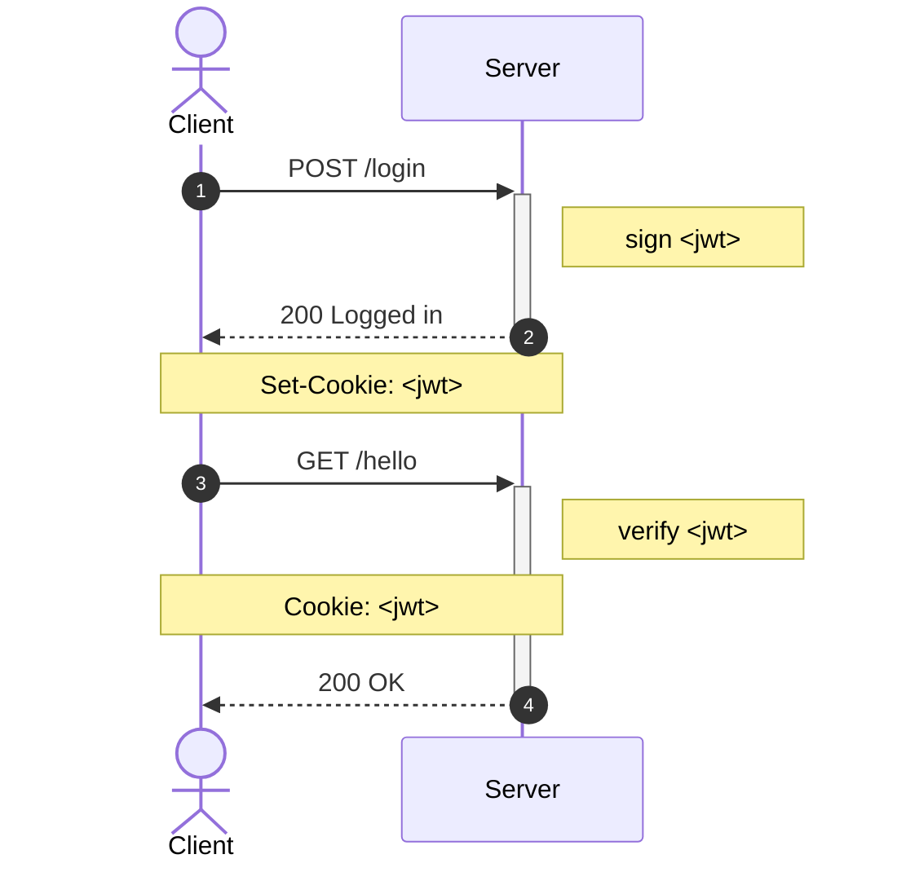
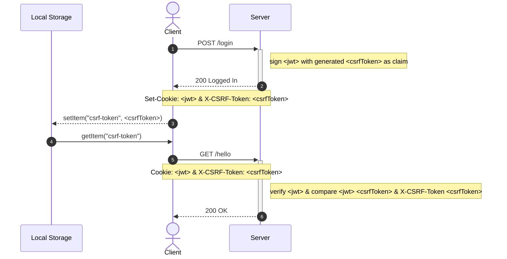

# worker-auth

- [worker-auth](#worker-auth)
  - [Motivation](#motivation)
  - [User Workflow](#user-workflow)
    - [The "Classic" Technique](#the-classic-technique)
    - [The "Double Submit Cookie" Technique](#the-double-submit-cookie-technique)
  - [Requirements](#requirements)
  - [Setup](#setup)
  - [Usage](#usage)
  - [Reference](#reference)

## Motivation

Stop comparing JWT & Cookie.

This PoC uses token (JWT) based authentication (contrary to session-based authentication). Generally, there are different 3 common ways to store authentication tokens such as JWT:

1. Cookie
2. Local Storage
3. Session Storage

This PoC aims to demonstrate how we can perform a 100% stateless authentication using token-based authentication with JWT with CSRF token to mitigate CSRF + XSS attacks.

## User Workflow

The diagram below shows how we implement user registration, login, and authorization.

### The "Classic" Technique

This is vulnerable to CSRF attacks.



### The "Double Submit Cookie" Technique



## Requirements

-   A [Cloudflare](https://www.cloudflare.com/) account
-   Install [Wrangler CLI](https://developers.cloudflare.com/workers/wrangler/cli-wrangler/) for Cloudflare Workers deployment

## Setup

```sh
❯ npm ci
# ...omitted for brevity...

❯ wrangler login
# ...omitted for brevity...

❯ wrangler kv:namespace create "USERS"
# ...omitted for brevity...
Add the following to your configuration file in your kv_namespaces array:
{ binding = "USERS", id = "bd445a5887f6437cb4ec9adb11a19106" }

❯ wrangler secret put SALT
 # ...omitted for brevity...
✨ Success! Uploaded secret SALT
```

## Usage

```sh
wrangler dev
```

## Reference

-   https://github.com/bezkoder/node-js-express-login-example
-   https://github.com/bigskysoftware/htmx/issues/607
-   https://blog.ropnop.com/storing-tokens-in-browser/
-   https://stackoverflow.com/questions/37582444/jwt-vs-cookies-for-token-based-authentication/37635977#37635977
-   https://youtu.be/67mezK3NzpU
