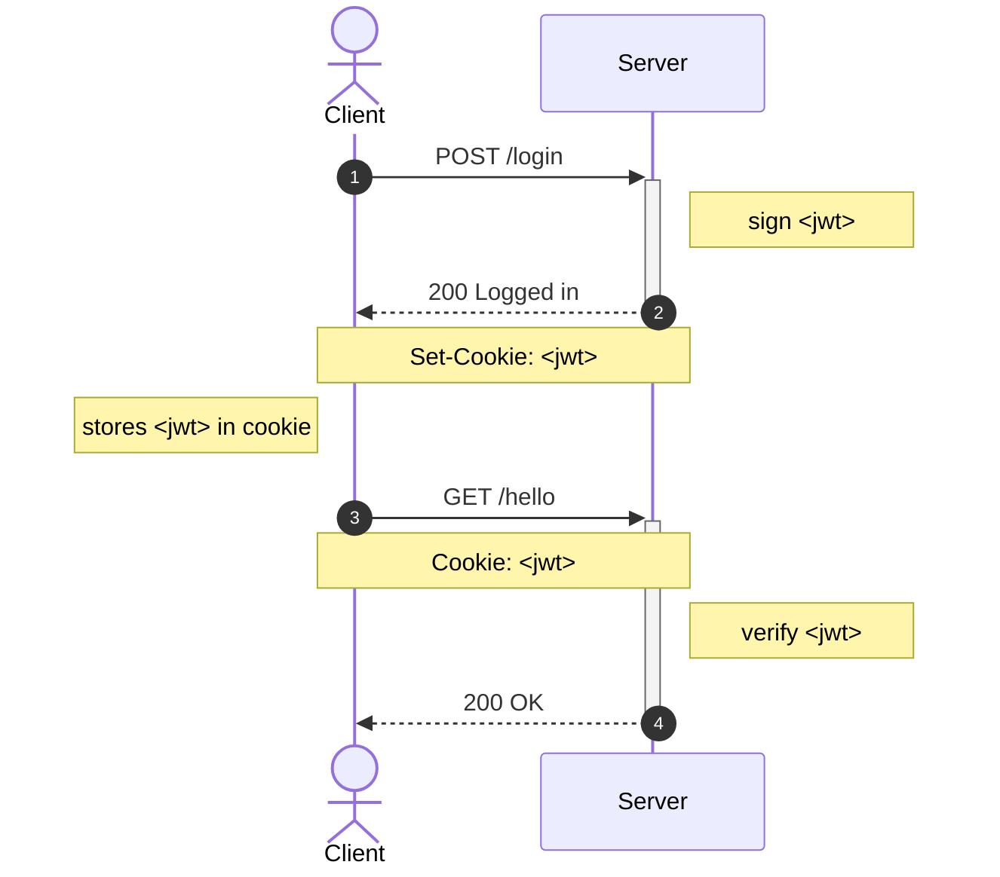
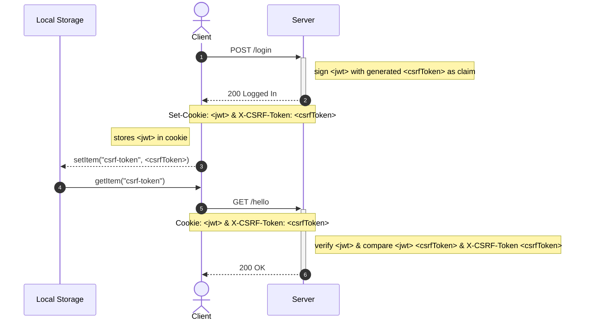

# worker-auth

- [worker-auth](#worker-auth)
  - [Context](#context)
  - [Motivation](#motivation)
  - [User Workflow](#user-workflow)
    - [The "Classic" Approach](#the-classic-approach)
    - [The Modified "Cookie-to-header token" Approach](#the-modified-cookie-to-header-token-approach)
  - [Requirements](#requirements)
  - [Setup](#setup)
  - [Usage](#usage)
  - [Reference](#reference)

## Context

To start, we need to stop comparing JWT and Cookie! They are not the same. Instead, the right comparison would be:

1. Token-based authentication
2. Session-based authentication

In this PoC, we will only talk about token-based authentication (specifically using JWT). You should check out the tradeoffs between using token-based authentication and session-based authentication.

When using token-based authentication, the most asked question is "where to store JWT in the browser?".

Generally, there are 2 common ways to store authentication tokens in the browser:

1. Cookie
2. Local Storage

Now, you may have heard of the following:

-   We should NOT keep authentication tokens in Local Storage as that is vulnerable to [XSS attacks](https://developer.mozilla.org/en-US/docs/Glossary/Cross-site_scripting).
-   We should NOT keep authentication tokens in Cookie as that is vulnerable to to [CSRF/XSRF attacks](https://developer.mozilla.org/en-US/docs/Glossary/CSRF).

## Motivation

The goal of this PoC is to demonstrate and implement a "modified" version of the "[Cookie-to-header token](https://en.wikipedia.org/wiki/Cross-site_request_forgery#Cookie-to-header_token)" approach to protect your site against XSS & CSRF attack (credits: [100% Stateless with JWT](https://youtu.be/67mezK3NzpU?t=2355)) when storing authentication tokens in Cookie.

Some other CSRF protection approaches are:

-   [Synchronizer Token Pattern](https://en.wikipedia.org/wiki/Cross-site_request_forgery#Synchronizer_token_pattern)
-   [Double Submit Cookie](https://en.wikipedia.org/wiki/Cross-site_request_forgery#Double_Submit_Cookie)

## User Workflow

The diagram below shows how we implement user registration, login, and authorization.

### The "Classic" Approach

_This is vulnerable to CSRF attacks because our `jwt` would be automatically sent by our browser (client) to the server._



### The Modified "Cookie-to-header token" Approach

_While our `jwt` is automatically sent by our browser, the server requires the client to also send along a `csrfToken` for verification._



## Requirements

-   A [Cloudflare](https://www.cloudflare.com/) account
-   Install [Wrangler CLI](https://developers.cloudflare.com/workers/wrangler/cli-wrangler/) for Cloudflare Workers deployment

## Setup

```sh
❯ npm ci
# ...omitted for brevity...

❯ wrangler login
# ...omitted for brevity...

❯ wrangler kv:namespace create "USERS"
# ...omitted for brevity...
Add the following to your configuration file in your kv_namespaces array:
{ binding = "USERS", id = "bd445a5887f6437cb4ec9adb11a19106" }

❯ wrangler secret put SALT
 # ...omitted for brevity...
✨ Success! Uploaded secret SALT
```

## Usage

```sh
wrangler dev
```

## Reference

-   https://github.com/bezkoder/node-js-express-login-example
-   https://github.com/bigskysoftware/htmx/issues/607
-   https://blog.ropnop.com/storing-tokens-in-browser/
-   https://stackoverflow.com/questions/37582444/jwt-vs-cookies-for-token-based-authentication/37635977#37635977
-   https://youtu.be/67mezK3NzpU
